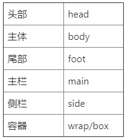
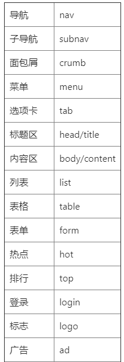
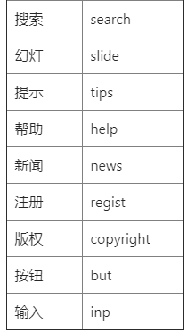
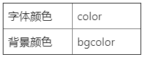
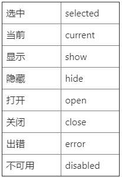

<!-- TOC -->

- [css 编程实践](#css-编程实践)
  - [一些优秀的 css 编码规范](#一些优秀的-css-编码规范)
  - [踩坑的历程](#踩坑的历程)
  - [为什么不使用 css modules](#为什么不使用-css-modules)
  - [正文](#正文)
  - [其他](#其他)
  - [文件组织](#文件组织)
  - [命名参考](#命名参考)

<!-- /TOC -->

<br>

# css 编程实践

当你接触 css 有一段时间后，会发现它并非那么的完美，没有局部作用域、变量等基本特性让 css 代码在稍上规模的项目中难以维护，当然，还有诸如浏览器兼容、多人协同样式冲突等大量让人头疼的问题。正因为这些，合理的组织 css 代码，善用工具变得尤为重要。

<br>

## 一些优秀的 css 编码规范

[BEM - Block Element Modifier](http://getbem.com/)

[网易 nec](http://nec.netease.com/standard)

本文所介绍的方法基于 BEM，关于它，网上有很多好的文章, 请自行搜索。

<br>

## 踩坑的历程

1. 直接撸空的 html 和 css 文件。
2. 对浏览器差异有了更深的理解，从\* { padding: 0;margin: 0; } 到 reset.css / normalize.css。
3. 不在使用 abcdefg 作为类名，改用类似 header、footer、content 等更语义化但是一不注意就冲突的类名。
4. 了解到 bootsrap 或者 materialize 等 css 框架，并强行用到前台项目中。
5. 在折腾 css 框架的过程中，你应该会学到很多东西，如更规范的命名 ‘first-last’，clearfix，center-block、color-red 这样的工具类，栅格，响应式开发，样式的复用与继承，学习每一个框架组件的写法后你对 css 的使用与了解有了十足的进步。
6. 开始尝试使用在各种视频教程博客中听过无数遍的 gulp、webpack、或者一些预编译器 sass、less、stylus 等，开发流程变得越来越有模有样, 效率大大的提高，折腾完每一个工具的配置也让你倍有成就感。
7. postcss， 到这里，你应该已经丧失不使用构建工具在空文件中写 css 的能力了。
8. 使用一些成熟的 css 规范 BEM、NEC 等。对绝大部分的 css 属性都有一定程度的了解，因为你已经在 MDN 上把 css 文档看了两遍以上，你现在要思考的仅仅是怎么更好的编写 css。
9. keep Exploring...

<br>

## 为什么不使用 css modules

1. 也用 css modules 做了两三个项目，但是主观的认为 css modules 并不适合自己，虽然最佳的开发实践是一个类名对应一个元素，但是有时候为了开发的流畅度(比如一个导航菜单，每一个导航项的前面要有一个 | 分隔符，通常我们会使用 & + & 这样的语法)，合理的使用伪类选择器能大大的提高幸福感。
2. 记住对于编程语言来说，保证程序质量的重要原则是 Don't Repeat Yourself，但是对于 css 来说，这一原则并不适用。更适合 css 的方式是 Keep It Simple, Stupid。如果你要为了复用一两块 css 代码而损失减少代码的可读性和复杂度，那是万万不可的，所以，保持简单就好。
3. 有时候业务需求改变，某一个组件中的一部分样式需要在其他地方使用，一种方法是另一个组件直接引入这个组件的 css，但是这样也就失去 css modules 的意义了；另一种方法是转到公共 css 里，让它变成普通的 css 类，但是这样做就跟把 function Component 转成 class Component 的过程一样，极度糟心。
4. 其实说到底了还是 sass + BEM 这样的方式虽然称不上完美，但是已经足够好用了，而其他模块化方案并没有给我必须使用它们的理由

<br>

## 正文

命名：  
对 BEM 做了一些小调整，保留了优点的同时对其稍作简化，以符合自己的实际开发。

<br>

1. 使用连字符或者驼峰作为块、元素名的分割。

```css
.myNav__leftSide--modifier {
  // 驼峰
}

.my-nav__left-side--modifier {
  // 连字
}
```

2. 双下划线的和单下划线都能实现块和元素的分割，所以使用更简单的单下划线。

```css
.myNav__leftSide--modifier {
  // before
}

.myNav_leftSide--modifier {
  // after
}
```

3. 在实际开发中，使用修饰符很容易出现下面这样类名过长过多的情况，改为双下划线+关联选择器, 这样可以大大减少页面中的代码干扰， 并且双下滑线+关联样式能有效避免类名冲突,这种写法违背了 BEM 的单类名原则，但是能有效避免类名过长的问题，在另一种角度来看，它们更像是继承，而不是修饰符, 不过同时也保持了 Keep It Simple, Stupid 的原则。

```html
<!-- before -->
<div class="myBtn myBtn--success myBtn--loading"></div>
// 短类名
<div class="myCustomBtn myCustomBtn--success myCustomBtn--loading"></div>

<!-- after -->
<button class="myBtn __success __loading"></button> // 短类名
<button class="myCustomBtn __success __loading"></button>
```

css

```css
// css
.myBtn {
  padding: 4px 12px;
}
.myBtn.__success {
  color: green;
}
.myBtn.__loading {
  opcity: 0.7;
}

// 带预编译的写法
.myBtn {
  padding: 4px 12px;

  &.__success {  // 灵活使用预编译语言精简代码, 这样的语法编译出来的css依然在顶层
    color: green;
  }

  &.__loading {
    opcity: 0.7;
  }
}

// 还有一种可选的方式能最大程度的保持html的干净程度
.myBtn {
  padding: 4px 12px;

  &__success {
    @extend .myBtn;  // 使用extend来继承样式，在编译后的代码中会以分组选择器的形式出现，不会有多余代码。（在某些极端情况下会导致分组过长）
    color: green;
  }
  &__loading {
    @extend .myBtn;
    opcity: 0.7;
  }
}


// html
<button class="myBtn"></button >
<button class="myBtn__succes"></button >
<button class="myBtn__loading"></button >
```

<br>

可以看到，在上面使用了不少 sass 语法，实际上就目前来说，想要编写清晰可维护的 css 代码，一门 css 预编译语言是基本中的基本。

<br>

## 其他

1. 修饰符的使用  
   通常习惯把整个大的块如导航条称为组件，把按钮等称为原件，两者是包含与被包含的关系，而修饰符的作用就是在存在多个类似的原件或组件时，从中提取出出现率最高，扩展为其他样式成本最低的样式作为基类，其他样式通过修饰符来实现。修饰符必须具有语义，如**hot、**active、\_\_disabled 等。

2. css 属性排序  
   影响元素大小位置的属性大于各种修饰属性（颜色、背景、阴影等）。

3. 某些明显或间接关联的属性写到一起。  
   position|left|top、height|line-heigh、width|height

4. 需要脚本控制的类名或 id 使用 J\_开头,驼峰或下划线（可同时用作变量名）分割。

```css
#J_MapBox
.J_abItem

#J_map_box
.J_tab_item
```

5. 有透明通道使用 png，反之 jpg，并根据质量需求选择色位。

6. css 可以做到就不要用 js，css 可以实现就不要用图片, 字体 icon > 图片 icon。

7. 为了更剩层次的避免命名冲突，可以在 block 的类名前加上当前页面、组件的缩写作为命名空间, 如 login.html 的块名写为 lg-block。

8. 布局样式与 block 分开来写, 以 l-(layout)开头，block 只作为布局元素的组成部分。

```css
<div class="l-head-top"></div>  // l_HeadTop
<div class="l-head-center">
  // 布局元素的内部由各种block块组成
</div>
<div class="l-head-foot"></div>
```

<br>

## 文件组织

```
sass-|
    // main.scss 引用其他所有入口文件 优选级为 重置|栅格 < 布局 < 元件 < 块 < 常用工具类
    -| main.scss     // 1.-> _base/normalize 2.-> layout/common 3.-> element/common 4.-> block/common 5. common.scss
    -| common.scss    // 公共样式 如 mt-20 pt-20 color-red bg-red等
    -| _base        // 栅格，重置样式
        -| index.scss    //入口
        -| normalize.scss
        -| var.scss
        -| util.scss
        -| grid.scss
        -| ....
    -| layout    // 存放页面级的布局 ( 页面中各个块的整体布局, 头部、主体、主栏、侧栏、尾部等 )
        -| common.scss    // 入口文件, 包含各页面的公共布局，以及引入所有page的布局
        -| page1.scss
    -| block    // 块级样式 (可以重复使用的较大的整体，比如导航、登录、注册、各种列表、评论、搜索等)
        -| common.scss    // 入口文件，包含公共块，引入其他的子块
        -| slide_bar.scss
        -| nav_bar.scss
    -| element    // 存放各种小元件 (不可再分的较为小巧的个体，通常被重复用于各种模块中，比如按钮、输入框、loading、图标等)
        -| common.scss    // 入口文件，包含公共元件，引入其他的元件
        -| btn.scss
        -| checkbox.scss
    -| page_scope    // 页面私有的样式
```

也可以看看这个项目  
<https://github.com/Iixianjie/sass-stater>

<br>

## 命名参考

**布局**  



<br>

**块、元素**  

  



<br>

**颜色**  



<br>

**状态**  

