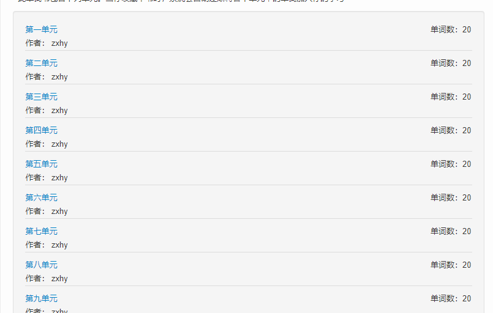
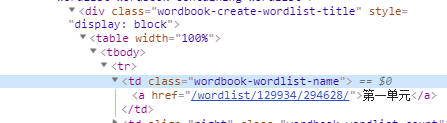
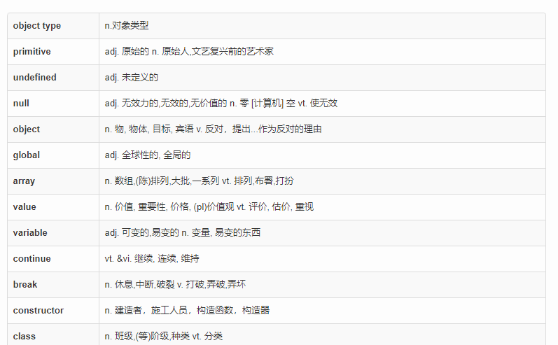
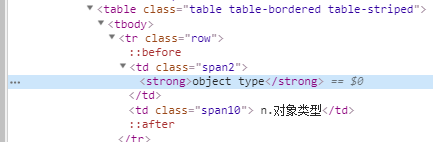
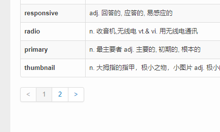

相信每一个开发做了一段时间的人都会知道英语对开发者的重要性，各种框架库的文档、更新日志、issue、各种变量命名。这些东西时效性都是很低的，如果只能一昧的等待别人汉化、更新，那永远都会被别人甩在后面, 更何况除了受众比较广的一些开源项目和优质文章，基本上是不会有汉化的。

正因为这些，不提高英语水平对一个有远大理想($)的coder的而言，绝对是万万不可的。

说到学英语，就少不了背单词，但是现在都是9012年了，不可能像让我们像高中的时候一样走到哪里都拿着个小本本吧。所以这段时间我也折腾了不少背单词的app，扇贝、百词斩、知米、沪江、网易背单词、天天背单词。都是非常优秀的软件，记忆曲线，定期复习等实用的功能大大提高了背单词的效率。

但是，问题又来了。每个单词软件的词库量都参差不齐，而且词库大都是服务在校生，各种考研人员。不过所幸有的单词软件支持用户自己上传词库, 下面是我用积分买的一些单词书


在这里再次感谢这些单词书的收集者😁。
问题又双来了，这些词库都是在线词库，虽然买了单词书，但是只能在该平台用，平台包含很多不支持买断的vip功能，自己又想把这些单词书放到自己想要的单词软件去背。问题有了，自然也会解决办法，目前大部分背单词app都支持自己上传单词生成词库，词库一般都是下面这种格式

```
// 前端单词大全.txt 格式是txt，单词间用回车分开
primitive
undefined
null
object
global
array
value
```

那现在要做的就是怎么把这些单词数据从别人的官网上爬下来并转换成自己需要的格式了，现有技术栈里node正好适合用来做这个工作，虽然以前没写过爬虫，但是大概知道要做的就是请求目标网页、分析页面结构、取出需要的数据。知道要做什么，ok，查查资料上手~

这里顺便分享一下最后爬取到的文件，仅供学习使用。

[github](https://github.com/qq1073830130/blog/tree/master/2019/4 '博客文件')


# 代码

依赖
```js
const axios = require('axios');   // 发起请求
const cheerio = require('cheerio');   // 类jq的node文档分析库
const fs = require('fs');   // 生成文件
```

<br/>

html结构:
列表结构

因为单词分为多个章节，需要先获取到各个章节的列表指向的地址




<br/>

内页结构




<br/>

数据大于20条时会出现分页




<br/>

先写一个函数用于获取列表、详情并写入到指定文件
```js
async function getDatas() {
  // 先调用获取目录的方法，对应函数在下方代码中
  let res = await getListUrl(urlprefix + '/wordbook/129934/');

  if(!res) return;

  // 根据获取到的列表地址数组获取详情
  await getDetail(res, (data) => {

    let tempArr = [];

    for(let [key, val] of Object.entries(data)) {
      tempArr.push(...val)
    }

    // 写入文件
    
    fs.writeFile('./output.txt', tempArr.join('\n'), err => {
      if(err) {
        console.log('写入文件时发生错误:', err);
        return;
      }

      console.log('写入完成!');


    })
  });
}
```

<br/>

// 获取列表的函数
```js
async function getListUrl(url) {
  let res = await axios.get(url);
  
  if(res.status !== 200) return;
  // 分享结构，取值
  let $ = cheerio.load(res.data);
  let wordlist = $('.wordbook-wordlist-name a');
  let urlArr = [];

  wordlist.each(function () {
    urlArr.push($(this).attr('href'))
  })

  return urlArr;
}
```

<br/>

// 获取详情
```js
/**
 * urls: <arr>  列表url组成的数组
 * cb: 所有数据都获取完后的回调
 * index: 用于递归的索引
 * init: 用于累加的数据
 * page: 在详情页，数据超过20条时会生成，分页，需要根据获取每一页的内容
 */
async function getDetail(urls, cb, index = 0, init = {}, page = 1) {
  if(index === urls.length) {
    cb(init)
    return;
  };

  let res = await axios.get(urlprefix + urls[index] + '?page=' + page);
  
  if(res.status !== 200) return;
  
  let $ = cheerio.load(res.data);
  // 获取单词
  let wordlist = $('.span2 strong');

  // 获取该章节的页码数(因为页码控件是jq插件生成的，直接$(selector)是获取不到节点的，所以需要手动正则一下)
  let pagesStr= res.data.match(/var pages = Math\.ceil\((\d+) \/ (\d+)\)/);
  let pageLength = Math.ceil(pagesStr[1] / pagesStr[2]);

  let urlArr = [];

  wordlist.each(function () {
    urlArr.push($(this).html())
  })

  init['chapter' + index + '_page' + page] = urlArr;

  console.log('总完成度 -> 当前章节：' + (index + 1) + '/' + urls.length + ' 当前页:' + page + '/' + pageLength);
  
  // 长度小于1直接取下一条，否则取下一页
  if(pageLength > 1 && pageLength !== page) {
    await getDetail(urls, cb, index, init, page + 1);
  }else {
    await getDetail(urls, cb, index + 1, init, 1);
  }
  
}

```