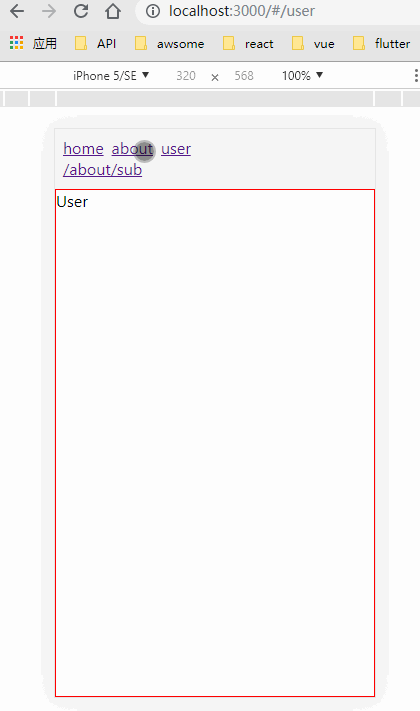
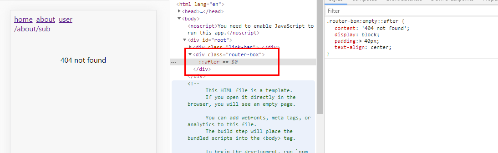

<h1 align="center">为react-router实现无副作用的路由动画</h1>

下面是比较常见的一种react-router动画实现方式:

```jsx
<TransitionGroup>
    <CSSTransition
        key={location.key}
        classNames="fade"
        timeout={300}
        >
        <Switch location={location}>
            <Route exact path="/hsl/:h/:s/:l" component={HSL} />
            <Route exact path="/rgb/:r/:g/:b" component={RGB} />
            <Route render={() => <div>Not Found</div>} />
        </Switch>
    </CSSTransition>
</TransitionGroup>
```

这种方式存在一个比较严重的问题，注意上面CSSTransition传递了当前的location.key作为key，这会导致每次路由切换时整个路由组件完全重载(不是重绘)。  

为了说明上面的问题，我举一个例子，假设现在存在一个列表和一个详情页，详情页作为列表的子路由，当从列表进入详情页时，由于location.key发生了改变，列表页会重载并且连续触发unmounted、mounted钩子，当你在列表页订阅了一些数据时，你会发现你在子路由中来回切换时列表在疯狂的请求数据...  

当然，你可以完全不使用子路由，这样的话每次跳转都只会简单的用新的路由页面替换旧的路由页面。  不过这种方式会带来一些其他的问题，比如:  

当你存在一个复杂的列表页，它包含许多复杂的功能比如虚拟滚动、上拉加载、以及包含多个过滤组件，这种情况下如果不使用子路由，只能考虑把所有列表状态保存到redux或session里，从详情页返回的时候再还原查询数据到查询组件、还原列表状态、回复滚动条位置...，光是想想就🤪，而使用子路由的话, 你可以轻松的完成下面的效果， 并且组件不会被不必要的重载！ 



可以查看这个官方示例，它使用Route组件的children来决定何时渲染路由组件，这种方式可以让你更好的控制如何给路由组件添加进入离开动画，并且不用在某个至关重要的位置添加location.key来造成组件不必要的更新:

<https://codesandbox.io/s/38qm5m0mz1?from-embed>  

<br>

但是~~，使用这种方式的话又会有两个问题：

1. 不能使用Switch组件，不能再使用文档推荐的方式来实现404页面了。

```jsx
<Switch>
    <Route path="/" exact component={Home} />
    <Redirect from="/old-match" to="/will-match" />
    <Route path="/will-match" component={WillMatch} />
    <Route component={NoMatch} />
</Switch>
```


2. 得为每一个<Router>组件都传入children，并且children里还要套一个又臭又长的function和CSSTransition。

```jsx
<Route key={path} exact path={path}>
    {({ match }) => (
        <CSSTransition
            in={match != null}
            timeout={300}
            classNames="page"
            unmountOnExit
            >
            <div className="page">
                <Component />
            </div>
        </CSSTransition>
    )}
</Route>
```


好在两个问题都比较好解决，下面放一下我的思路： 

对于问题2，其实就是一个包装组件就解决的事，问题1则比较棘手，在各种搜索引擎加issue都没找到解决的方式，暂时想到了一个比较迂回的方式来处理，见下图：



把所有Route都移到一个包装元素内，当没有组件被渲染时，元素为空，这时就触发了:empty选择器，通过伪类来设置文字提示或者图片提示即可。


对于上面的解决方案，我上传了一个开箱即用的组件到npm，它包括如下功能：  

* 仿原生的路由动画(主要路由fade，子路由进入时右滑入，离开时右滑出)
* 可根据CSSTransition规则自定义路由动画
* 路由变更监听，可以通过下面这样的方式传入额外数据，然后在指定的位置进行接收

```js
<Route path="/about" component={About} meta={{name: 'lxj', age: 'xxx'}} />
```

react-transition-route


